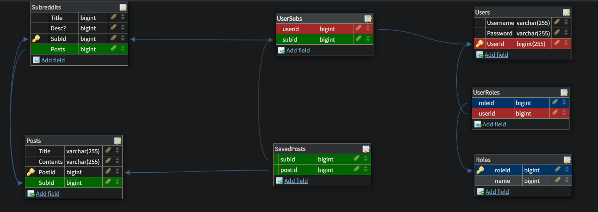
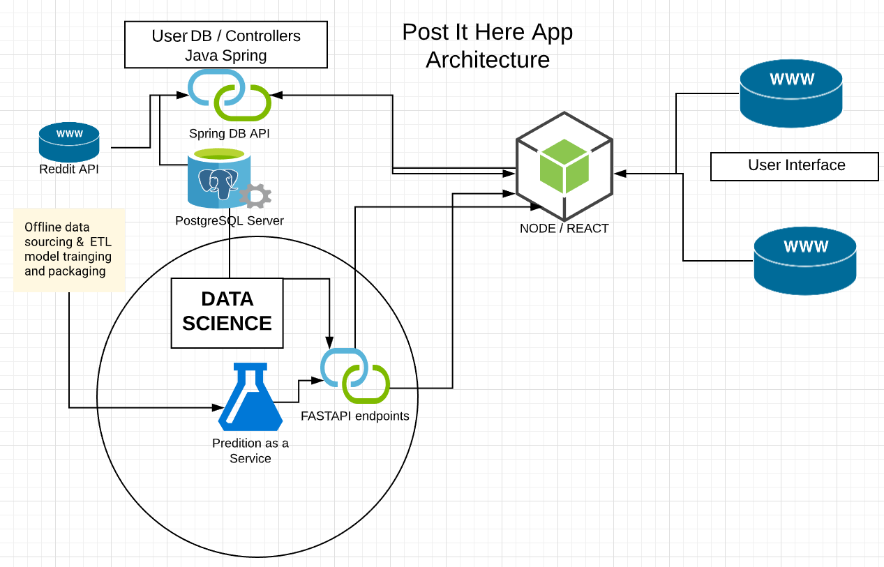

# Post-It-Here Backend
## Utilizes Reddit's API and an API for Machine Learning
### Generates Subreddits based on a submitted post

### Technologies Used :computer:
- Spring Boot
- Java
- Heroku
- Swagger Docs
- IntelliJ

<a href="https://postit-user-app.herokuapp.com/swagger-ui.html" target="_blank">Documentation</a>

### System Design

     

